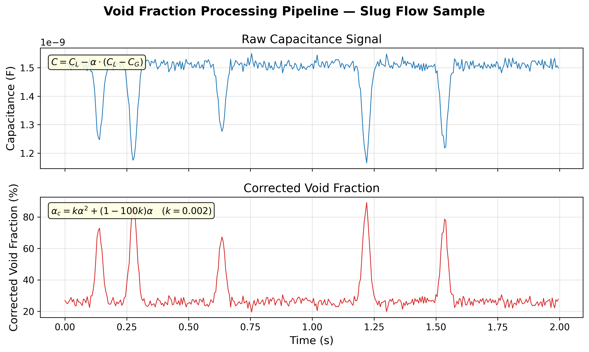
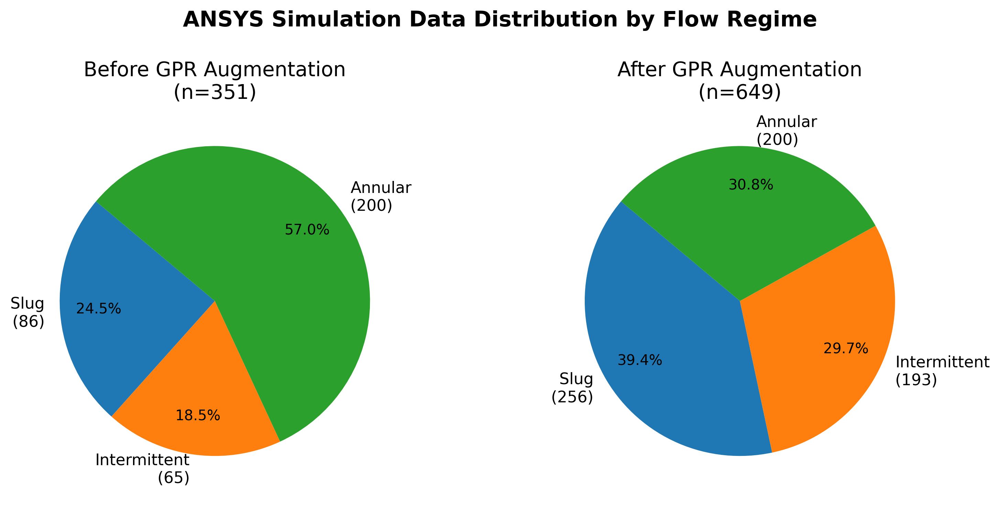

# ECLIPSE — Cryogenic Two-Phase Flow Instrumentation

**What this is:** A Python implementation of the sensor signal processing pipeline from UIUC's submission to NASA's Human Lander Challenge (HuLC 2026). The pipeline classifies flow regimes in cryogenic propellant transfer lines using capacitance sensing and unsupervised ML.

**Why it matters:** NASA's Artemis program requires transferring cryogenic propellants (liquid oxygen, liquid methane) in microgravity. Without gravity-driven phase separation, the flow can transition unpredictably between regimes — directly affecting engine start reliability. This sensor monitors the flow state in real time so transfer operations can respond accordingly.

---

## The Problem

When a cryogenic fluid flows through a pipe at low heat flux, it undergoes **inverted annular film boiling**: a vapor layer forms at the pipe wall, trapping liquid in the center. As heat flux or flow velocity changes, this transitions through distinct regimes. Identifying which regime is active — from a noisy electrical sensor signal, in real time — is the core instrumentation problem.

## The Pipeline

```
Raw capacitance signal
        │
        ▼
  Void fraction extraction
  α = (C_L − C_M) / (C_L − C_G) × 100%
        │
        ▼
  Nonlinear correction
  α_c = k·α² + (1 − 100k)·α
        │
        ▼
  Windowed feature extraction
  [mean, variance, kurtosis] per 0.1s window
        │
        ▼
  Fuzzy c-means (3 clusters)
        │
        ▼
  Flow regime label: Slug / Intermittent / Annular
```

## Flow Regimes

- **Slug** — large vapor bubbles travel intermittently through liquid-dominated flow. High capacitance (mostly liquid), high signal variance and kurtosis from bubble-induced spikes.
- **Intermittent** — transitional state between slug and annular. Moderate capacitance, moderate variance.
- **Annular** — stable vapor core with thin liquid film at the pipe wall. Low capacitance (mostly vapor), low variance, smooth signal near C_gas.

## Quickstart

```bash
pip install -r instrumentation/requirements.txt
python instrumentation/demo.py
```

Output appears in `instrumentation/outputs/`.

## Output

**Flow regime map — 3D feature space (ANSYS CFD ● + Synthetic ▲)**


**Synthetic capacitance signals by regime**


**Void fraction processing pipeline**



**Before/after GPR augmentation**



## Technical Details

| Component | Detail |
|---|---|
| Sensor | Asymmetric parallel-plate capacitance electrodes, 10-inch pipe, 25V potential |
| Sampling | ≥ 200 Hz per sensor specification |
| Void fraction | Corrected per Eq. 1 of ECLIPSE paper (Sakamoto et al. 2018 calibration model) |
| Feature window | 0.1s (20 samples at 200 Hz): mean capacitance, variance, raw 4th central moment |
| Augmentation | Gaussian Process Regression (RBF + WhiteKernel) on sparse ANSYS regimes before clustering |
| Classifier | Fuzzy c-means, 3 clusters, relabeled by mean capacitance: slug (highest) → annular (lowest) |
| Synthetic data | `sensor_sim.py` generates regime-specific signals without ANSYS — makes the pipeline fully self-contained |
| Tests | `pytest instrumentation/tests/` — covers physics invariants, feature extraction shape/value, ML relabeling |

## Project Structure

```
instrumentation/
  void_fraction.py    — sensor math: linear/corrected void fraction, thermal correction, permittivity
  sensor_sim.py       — synthetic capacitance signal generator for all three regimes
  flow_regime.py      — ANSYS data loader, GPR augmentation, feature extraction, Fuzzy c-means
  demo.py             — run this: generates all figures end-to-end
  data/
    volume-average-rfile.csv   — ANSYS CFD simulation output (1001 time steps)
  tests/              — pytest suite
  outputs/            — generated figures (created by demo.py)
Instrumentation/
  clustering.ipynb    — original research notebook (preserved)
```

## My Role

Instrumentation Team Lead — I designed and implemented the capacitance sensor algorithm, void fraction processing pipeline, and flow regime identification approach described in Section V of the ECLIPSE technical paper. This repository refactors that work into a clean, testable Python package.
