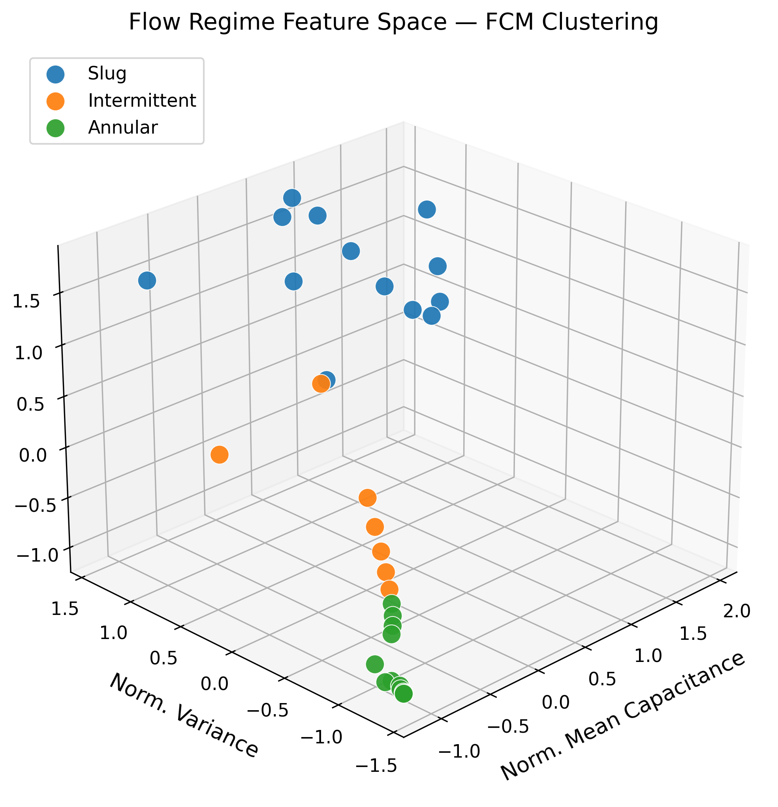
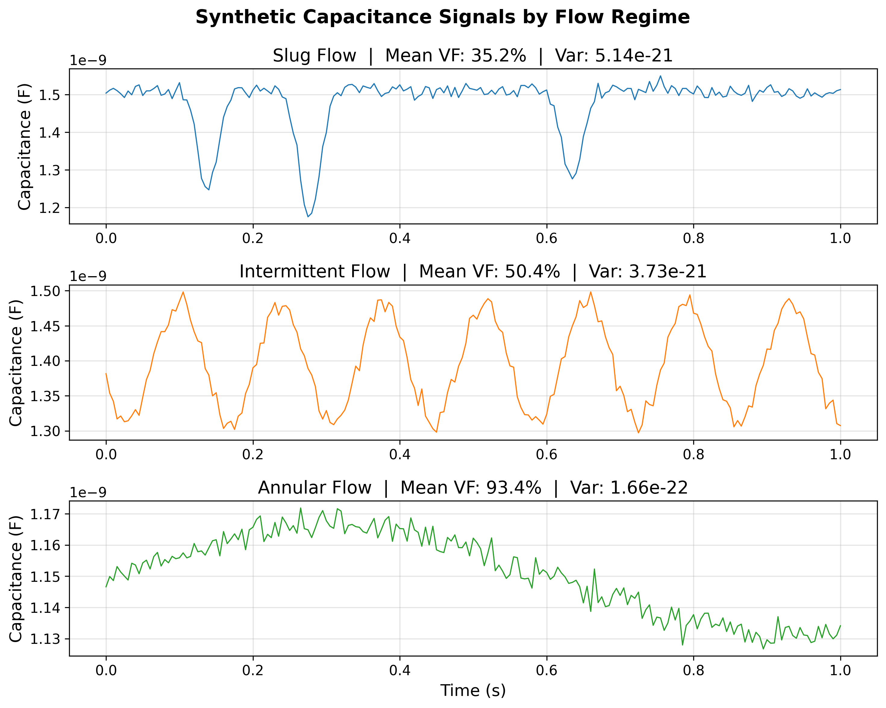

# ECLIPSE: Cryogenic Flow Instrumentation

Implementation of the capacitance sensor pipeline from UIUC's NASA Human Lander Challenge (2026) submission. It identifies the flow regime inside a cryogenic propellant transfer line in real time using only an electrical signal.

**Why it matters:** Transferring liquid oxygen / methane in microgravity creates unpredictable two-phase flow. Knowing which regime is active (slug, intermittent, annular) is required for safe engine start for Artemis missions.

---

## The pipeline

```
Raw capacitance signal
        │
        ▼
  Void fraction  →  α = (C_L − C_M) / (C_L − C_G) × 100%
        │
        ▼
  Nonlinear correction  →  α_c = k·α² + (1 − 100k)·α
        │
        ▼
  Windowed features: [mean, variance, kurtosis] per 0.1 s
        │
        ▼
  Fuzzy c-means → Slug / Intermittent / Annular
```

**Flow regimes**
- **Slug** — intermittent large bubbles in liquid-dominated flow; high capacitance, high variance
- **Intermittent** — transitional; moderate capacitance, moderate variance
- **Annular** — stable vapor core, thin liquid wall film; low capacitance, smooth signal

## Quickstart

```bash
pip install -r instrumentation/requirements.txt
python instrumentation/demo.py
```

Figures are saved to `instrumentation/outputs/`.

## Output


*3D feature space — ANSYS CFD windows colored by FCM-assigned regime*


*One-second capacitance traces per regime: slug is spiky, annular is smooth*

## How it works

| Step | Implementation |
|---|---|
| Sensor | Asymmetric parallel-plate capacitor around a 10-inch pipe, 25 V excitation, ≥ 200 Hz sampling |
| Void fraction | Linear extraction + nonlinear correction (Eq. 1 of ECLIPSE paper) |
| Augmentation | GPR (RBF + WhiteKernel) interpolates slug and intermittent ANSYS data before clustering |
| Features | Windowed mean, variance, and raw 4th central moment — `scipy.stats.moment(x, 4)`, not Fisher-corrected kurtosis |
| Classifier | `fcmeans.FCM(n_clusters=3)`, relabeled by ascending mean capacitance |
| Synthetic data | `sensor_sim.py` generates realistic signals for all three regimes so the demo runs without ANSYS |

## Tests

```bash
pytest instrumentation/tests/ -v
```

13 tests covering physics invariants, feature extraction correctness, and classifier relabeling.
